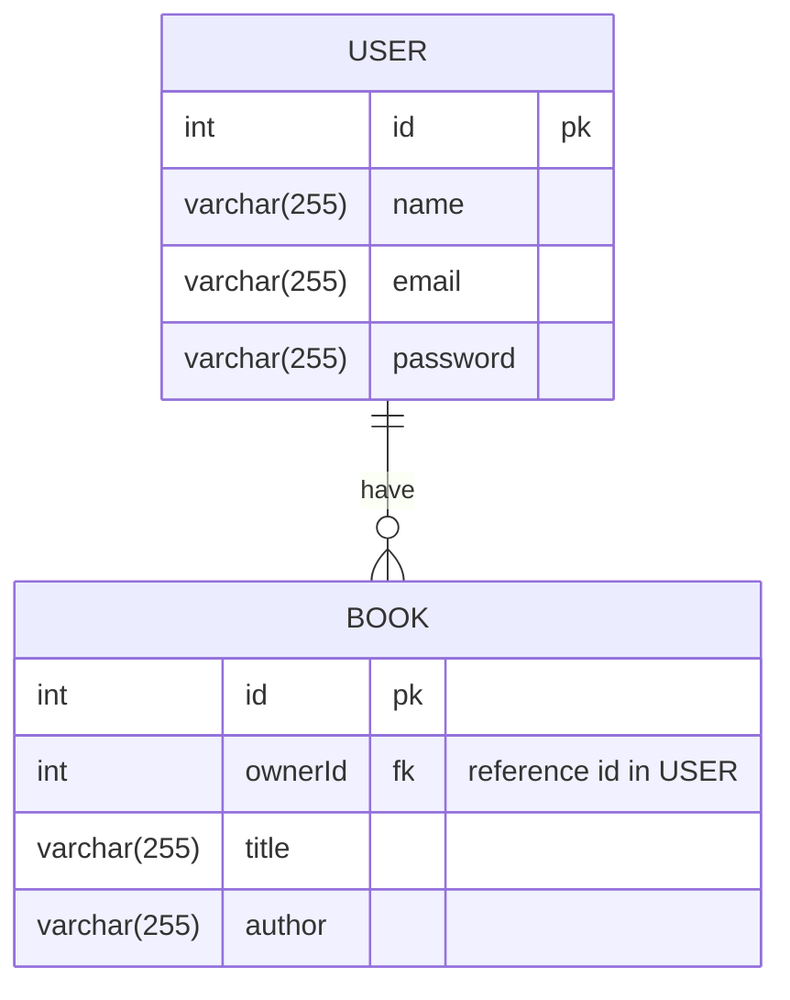

# sequelize-practice
CRUD with Sequelize & Express

## Entity Relation Diagram

## Things I practiced
### Express
- middleware
- router
- error handler
### Seuqelize
- model
- migration
- association & custom foreign key
### passport.js (authentication)
- local strategy (session)
### Notes generated during debugging
https://gist.github.com/devusexu/e8714ddd946e150aa77692b05490a0c7

